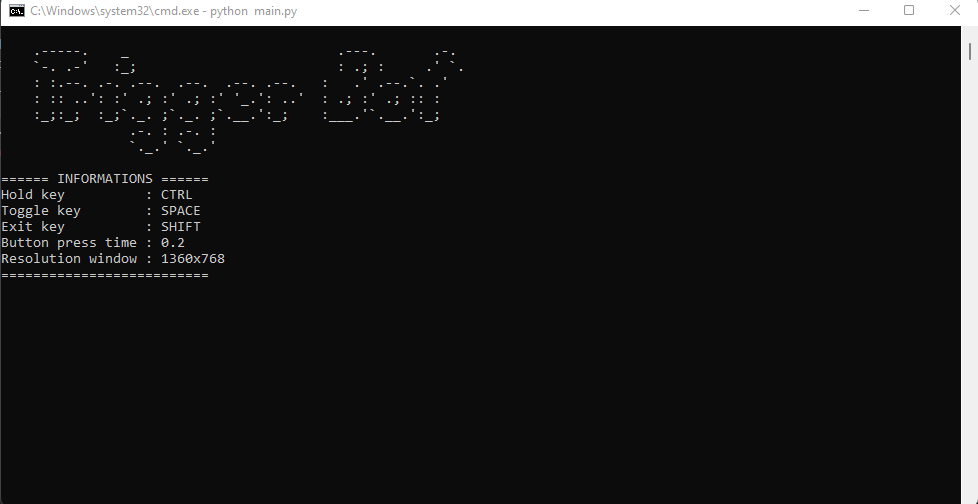

# TriggerBot pixel color

Essa é um bot trigger em Python que automatiza o disparo das armas com base na identificação do inimico a partir da coloração do contorno do próprio.

* **Status**: NOT DETECTED
* **Verification date**: 2023-03-25

## Requisitos
* Python 3.x
* Bibliotecas: keyboard, pyautogui, pygetwindow, matplotlib

## Como usar
1. Clone o repositório em sua máquina local.
```bash
git clone https://github.com/seu-usuario/valorant-bot.git
```
2. Instale as dependências usando o pip.
```bash
pip install -r requirements.txt
```
3. Execute o script trigger_bot.py.
```bash
python main.py
```
4. O menu do programa ficará dessa forma no terminal.




## Observações
* O programa viola os Termos de Serviço do jogo. Esse script foi criado apenas para estudo e não indico a utilização do mesmo dentro do jogo para não prejudicar a empresa do mesmo e nenhum outro jogador.

* Este script é simples, porém funcional. Ele atira quando detecta um inimigo, mas é importante lembrar que é uma solução muito básica e não se compara às alternativas disponíveis no mercado que usam métodos mais avançados. Embora eu tenha testado esse script em vários modos de jogo sem nunca ter sido banido, é importante ressaltar que a utilização do mesmo é de total responsabilidade do usuário.

* O programa funciona somente em resolução de tela 1360x768. Caso sua resolução seja diferente, será necessário ajustar as constantes WIDTH e HEIGHT no arquivo config.py.